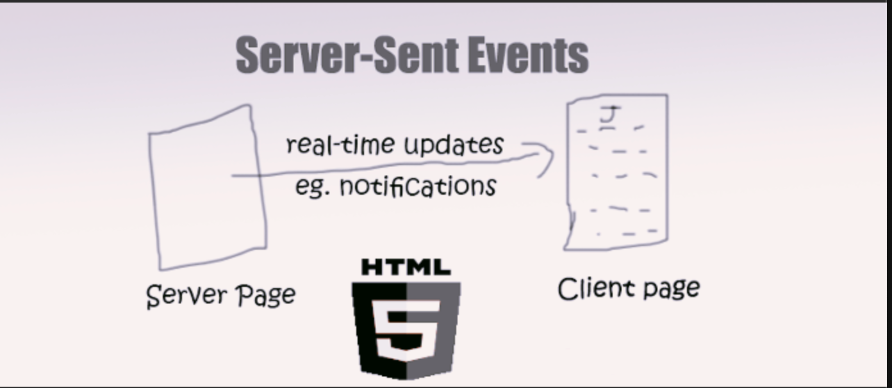
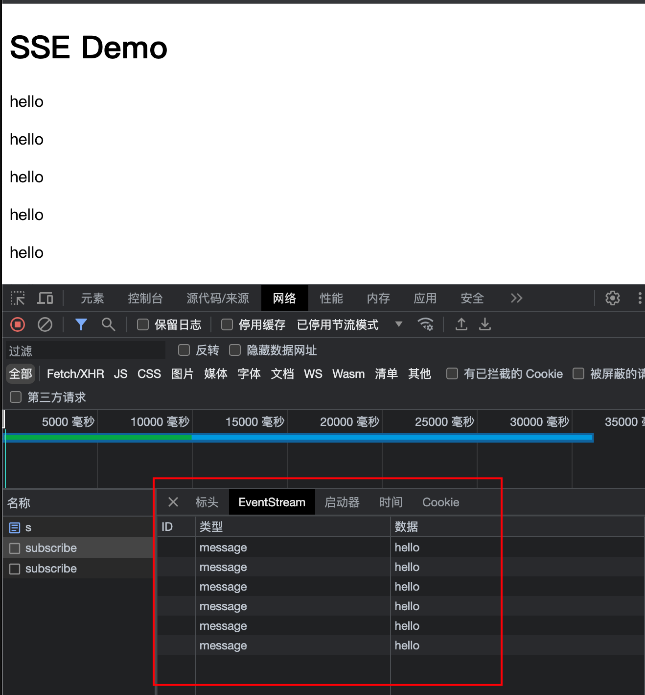
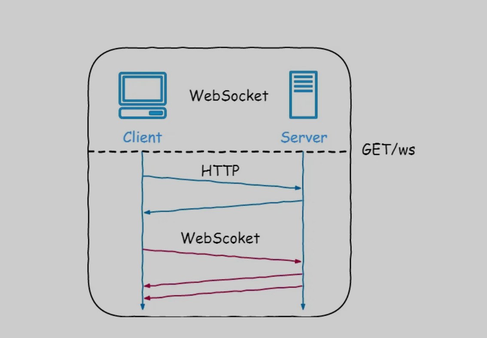
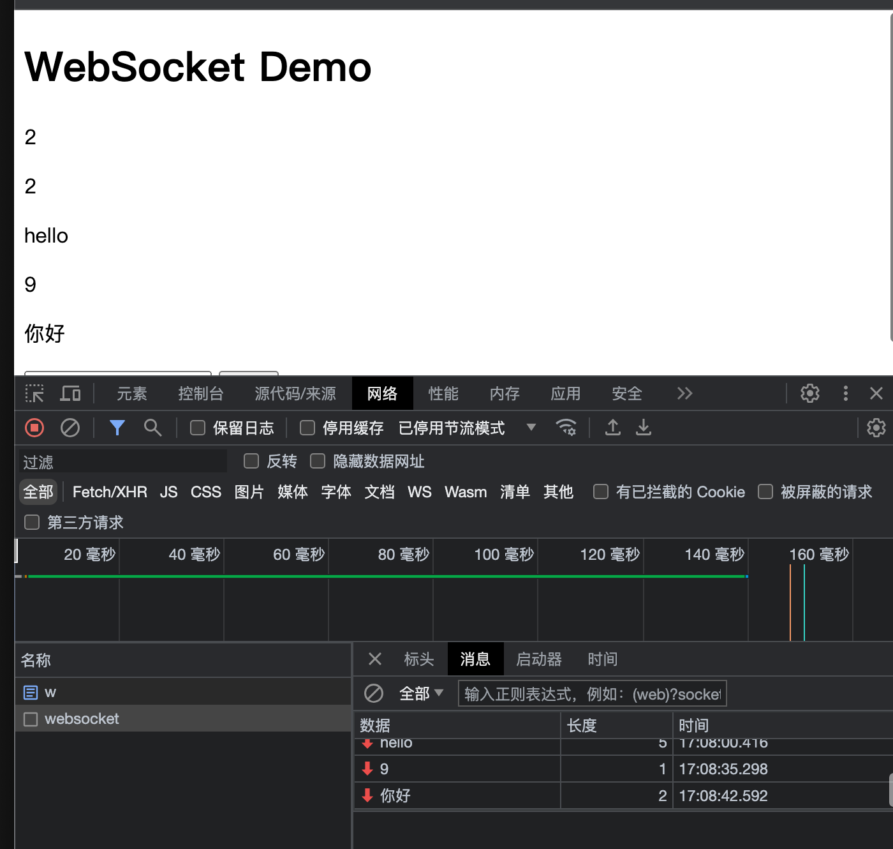

# 消息推送

当构建实时消息推送功能时，选择适合的方案对于开发高效的实时应用至关重要。消息的推送无非就推、拉两种数据模型。本文将介绍四种常见的消息实时推送方案：短轮询（拉）、长轮训（拉）、`SSE（Server-Sent Events）`（推）和`WebSocket`（推），并以Spring Boot作为技术底座，展示如何在Java全栈开发中实现这些功能。

## 1. 短轮询（Short Polling）

### 什么是短轮询？

短轮询是一种简单的实时消息推送方案，其中客户端通过定期向服务器发送请求来获取最新的消息。服务器在接收到请求后立即响应，无论是否有新消息。如果服务器没有新消息可用，客户端将再次发送请求。

### 短轮询的实现

在Spring Boot中，可以通过HTTP接口和定时任务来实现短轮询。下面是一个简单的示例：

```java
// -- 后端接口
@GetMapping("/short")
public String  getShort() {
    long l = System.currentTimeMillis();
    if((l&1) == 1) {
        return "ok";
    }
    return "fail";
}


// --- 前端页面
@org.springframework.stereotype.Controller
public class Controller {

    @GetMapping("/s")
    public String s() {
        return "s";
    }
}

// -- s.html

<!DOCTYPE html>
<html lang="en">
<head>
    <meta charset="UTF-8">
    <title>短轮询</title>
</head>
<body>
<p>msg=<span id="message"></span></p>
<script>
    function pollMessage() {
// 发送轮询请求
        const xhr = new XMLHttpRequest();
        xhr.open("GET", "/short", true);
        xhr.onreadystatechange = function () {
            if (xhr.readyState === XMLHttpRequest.DONE) {
                if (xhr.status === 200) {
                    document.getElementById("message").innerHTML = xhr.responseText;
                }
            }
        };
        xhr.send();
    }
    setInterval(()=>{
        pollMessage()
    }, 1000)

</script>
</body>
</html>


```

在上述示例中，`getShort()`方法用于返回消息，而`s`方法用于渲染`s.html`。客户端可以定期调用`getShort()`接口来获取最新的消息。

### 短轮询的特点与限制

短轮询的实现简单，但存在一些特点和限制：

- **高延迟：** 客户端需要定期发送请求，无论是否有新消息。这会导致一定的延迟，特别是在消息更新较慢的情况下。
- **高网络负载：** 客户端需要频繁发送请求，即使消息没有更新。这会增加服务器和网络的负载。
- **实时性差：** 由于需要等待下一次轮询才能获取新消息，短轮询的实时性相对较差。

## 2. 长轮询（Long Polling）

### 什么是长轮询？

长轮询是改进的轮询方法，它在没有新消息时会保持请求挂起，直到有新消息到达或超时。相比于短轮询，长轮询可以更快地获取新消息，减少了不必要的请求。

### 长轮询的实现

在Spring Boot中，可以使用异步请求和定时任务来实现长轮询。下面是一个简单的示例：

```java
// -- 请求接口

/**
 * 长轮询
 * @return
 */
@GetMapping("/long")
public DeferredResult<String> getLong() {
    DeferredResult<String> deferredResult = new DeferredResult<>();

    if (latestMessage != null) {
        deferredResult.setResult(latestMessage);
    } else {
        // 使用定时任务设置超时时间
        TimerTask timeoutTask = new TimerTask() {
            @Override
            public void run() {
                deferredResult.setResult(null);
            }
        };
        Timer timer = new Timer();
        timer.schedule(timeoutTask, 5000); // 设置超时时间为5秒

        // 设置回调函数，在消息到达时触发
        deferredResult.onTimeout(() -> {
            timer.cancel();
            deferredResult.setResult(null);
        });

        deferredResult.onCompletion(timer::cancel);
    }

    return deferredResult;
}

/**
 * 设置消息
 * @param message
 */
@PostMapping("/send-message")
public void sendMessage(@RequestBody String message) {
    latestMessage = message;
}


// -- 前端请求

<!DOCTYPE html>
<html lang="en">
<head>
    <meta charset="UTF-8">
    <title>长轮询</title>
</head>
<body>
<p>msg=<span id="message"></span></p>
<p>请求次数：<span id="cnt"></span></p>
<script>
    var cnt = 0
    function pollMessage() {
// 发送轮询请求
        const xhr = new XMLHttpRequest();
        xhr.open("GET", "/long", true);
        xhr.onreadystatechange = function () {
            if (xhr.readyState === XMLHttpRequest.DONE) {
                if (xhr.status === 200) {
                    document.getElementById("message").innerHTML = xhr.responseText;
                }
            }
        };
        xhr.send();
    }

    setInterval(()=>{
        ++cnt;
        document.getElementById('cnt').innerHTML = cnt.toString()
        pollMessage()
    }, 5000)

</script>
</body>
</html>


```

在上述示例中，`getLong()`方法返回一个`DeferredResult`对象，它会在有新消息到达时触发回调函数。如果在超时时间内没有新消息到达，`DeferredResult`对象将返回`null`。

### 长轮询的特点与限制

长轮询具有以下特点与限制：

- **减少请求次数：** 长轮询可以更快地获取新消息，相比于短轮询，可以减少不必要的请求次数。
- **减少网络负载：** 当没有新消息时，长轮询会保持请求挂起，减少了频繁的请求，从而减轻了服务器和网络的负载。
- **相对实时性提升：** 长轮询可以更快地获取新消息，相比于短轮询，实时性有所提升。然而，仍然需要等待下一次轮询才能获取新消息。

## 3. SSE（Server-Sent Events）



### 什么是SSE？

当使用`Server-Sent Events（SSE）`时，客户端（通常是浏览器）与服务器之间建立一种持久的连接，使服务器能够主动向客户端发送数据。这种单向的、服务器主动推送数据的通信模式使得实时更新的数据能够被实时地传送到客户端，而无需客户端进行轮询请求。

SSE的工作原理如下：

1. 建立连接：客户端通过使用`EventSource`对象在浏览器中创建一个与服务器的连接。客户端向服务器发送一个HTTP请求，请求的头部包含`Accept: text/event-stream`，以表明客户端希望接收SSE数据。服务器响应这个请求，并建立一个持久的HTTP连接。
2. 保持连接：服务器保持与客户端的连接打开状态，不断发送数据。这个连接是单向的，只允许服务器向客户端发送数据，客户端不能向服务器发送数据。
3. 服务器发送事件：服务器使用`Content-Type: text/event-stream`标头来指示响应是SSE数据流。服务器将数据封装在特定的SSE格式中，每个事件都以`data:`开头，后面是实际的数据内容，以及可选的其他字段，如`event:`和`id:`。服务器发送的数据可以是任何文本格式，通常是JSON。
4. 客户端接收事件：客户端通过`EventSource`对象监听服务器发送的事件。当服务器发送事件时，`EventSource`对象会触发相应的事件处理程序，开发人员可以在处理程序中获取到事件数据并进行相应的操作。常见的事件是`message`事件，表示接收到新的消息。
5. 断开连接：当客户端不再需要接收服务器的事件时，可以关闭连接。客户端可以调用`EventSource`对象的`close()`方法来显式关闭连接，或者浏览器在页面卸载时会自动关闭连接。


### SSE的实现

在Spring Boot中，可以使用`SseEmitter`类来实现SSE。下面是一个简单的示例：

```java
@RestController
public class SSEController {
    private SseEmitter sseEmitter;

    @GetMapping("/subscribe")
    public SseEmitter subscribe() {
        sseEmitter = new SseEmitter();
        return sseEmitter;
    }

    @PostMapping("/send-message")
    public void sendMessage(@RequestBody String message) {
        try {
            if (sseEmitter != null) {
                sseEmitter.send(SseEmitter.event().data(message));
            }
        } catch (IOException e) {
            e.printStackTrace();
        }
    }
}


// - s.html

<!DOCTYPE html>
<html>
<head>
    <title>SSE Demo</title>
</head>
<body>
<h1>SSE Demo</h1>
<div id="message-container"></div>

<script>
    // 创建一个EventSource对象，指定SSE的服务端端点
    var eventSource = new EventSource('/subscribe');
    console.log("eventSource=", eventSource)
    // 监听message事件，接收从服务端发送的消息
    eventSource.addEventListener('message', function(event) {
        var message = event.data;
        console.log("message=", message)
        var messageContainer = document.getElementById('message-container');
        messageContainer.innerHTML += '<p>' + message + '</p>';
    });
</script>
</body>
</html>
```

在上述示例中，客户端可以通过访问`/subscribe`接口来订阅SSE事件，服务器会返回一个`SseEmitter`对象。当有新消息到达时，调用`SseEmitter`对象的`send()`方法发送消息。



### SSE的特点与限制

SSE具有以下特点与限制：

- **实时性较好：** SSE使用了持久连接，可以实现比短轮询和长轮询更好的实时性。
- **单向通信：** SSE是单向的，只允许服务器向客户端推送消息，客户端无法向服务器发送消息。
- **不适用于低版本浏览器：** SSE是HTML5的一部分，不支持低版本的浏览器。在使用SSE时，需要确保客户端浏览器的兼容性。


## 4. WebSocket



### 什么是WebSocket？

WebSocket是一种双向通信协议，允许在单个持久连接上进行全双工通信。与之前介绍的方案不同，WebSocket提供了双向通信的能力，可以实现实时的双向数据传输。

### WebSocket的实现

在Spring Boot中，可以使用Spring WebSocket模块来实现WebSocket功能。下面是一个简单的示例：

#### 1. 创建一个WebSocket处理器：

```java
@Component
public class WebSocketHandler extends TextWebSocketHandler {
    private List<WebSocketSession> sessions = new CopyOnWriteArrayList<>();

    @Override
    public void afterConnectionEstablished(WebSocketSession session) throws Exception {
        sessions.add(session);
    }

    @Override
    protected void handleTextMessage(WebSocketSession session, TextMessage message) throws Exception {
        for (WebSocketSession webSocketSession : sessions) {
            webSocketSession.sendMessage(message);
        }
    }

    @Override
    public void afterConnectionClosed(WebSocketSession session, CloseStatus status) throws Exception {
        sessions.remove(session);
    }
}
```

#### 2. 配置WebSocket端点：


```java
@Configuration
@EnableWebSocket
public class WebSocketConfig implements WebSocketConfigurer {
    @Autowired
    private WebSocketHandler webSocketHandler;

    @Override
    public void registerWebSocketHandlers(WebSocketHandlerRegistry registry) {
        registry.addHandler(webSocketHandler, "/websocket").setAllowedOrigins("*");
    }
}
```

在上述示例中，`WebSocketHandler`处理器负责处理WebSocket连接、消息传递和连接关闭等事件。`WebSocketConfig`类用于配置WebSocket端点。

#### 3. 前端实现

```html
<!DOCTYPE html>
<html>
<head>
    <title>WebSocket Demo</title>
</head>
<body>
<h1>WebSocket Demo</h1>
<div id="message-container"></div>

<script>
    // 创建WebSocket对象，并指定服务器的URL
    var socket = new WebSocket('ws://localhost:8080/websocket');

    // 监听WebSocket的连接事件
    socket.onopen = function(event) {
        console.log('WebSocket connected');
    };

    // 监听WebSocket的消息事件
    socket.onmessage = function(event) {
        var message = event.data;
        var messageContainer = document.getElementById('message-container');
        messageContainer.innerHTML += '<p>' + message + '</p>';
    };

    // 监听WebSocket的关闭事件
    socket.onclose = function(event) {
        console.log('WebSocket closed');
    };

    // 发送消息到服务器
    function sendMessage() {
        var messageInput = document.getElementById('message-input');
        var message = messageInput.value;
        socket.send(message);
        messageInput.value = '';
    }
</script>

<input type="text" id="message-input" placeholder="Enter message">
<button onclick="sendMessage()">Send</button>
</body>
</html>
```




### WebSocket的特点与限制

WebSocket具有以下特点与限制：

- **实时性最佳：** WebSocket 提供了真正的双向通信，可以实现实时的双向数据传输，具有最佳的实时性。
- **低延迟：** 与轮询和长轮询相比，WebSocket 使用单个持久连接，减少了连接建立和断开的开销，从而降低了延迟。
- **双向通信：** WebSocket 允许服务器与客户端之间进行双向通信，服务器可以主动向客户端发送消息，同时客户端也可以向服务器发送消息。
- **较高的网络负载：** WebSocket 使用长连接，会占用一定的网络资源。在大规模并发场景下，需要注意服务器的负载情况。
- **浏览器支持：** 大多数现代浏览器都支持 WebSocket，但需要注意在开发过程中考虑不同浏览器的兼容性。

# 总结

本文介绍了四种常见的消息实时推送方案：短轮询、长轮询、`SSE` 和` WebSocket`，并以 Spring Boot 作为技术底座，展示了如何在 Java 全栈开发中实现这些功能。

- 短轮询是一种简单的实时消息推送方案，但存在高延迟、高网络负载和实时性差的限制。
- 长轮询通过保持请求挂起来减少不必要的请求次数，提高了实时性，但仍需要轮询才能获取新消息。
- SSE 使用持久连接实现单向实时消息推送，具有较好的实时性，但只支持服务器向客户端的单向通信。
- WebSocket 提供了真正的双向通信，具有最佳的实时性和低延迟，但需要注意较高的网络负载和浏览器兼容性。

选择合适的消息实时推送方案取决于具体的需求和场景。根据应用程序的要求和预期的用户体验，开发人员可以选择适当的方案来实现实时消息推送功能。


# 注意

以上实现均属于`demo` 级别，为了简单演示，将所有的服务保证措施都删除了，所以存在包括但不限于以下缺点

比如

* `sse`

1. 没有做会话管理
2. 明文传输

* `WebSocket` 

1. 客户端连接的区分，目前的实现属于消息广播。

2. 连接的可靠性保证：心跳检测以及自动重连等。

3. 消息的明文传输

